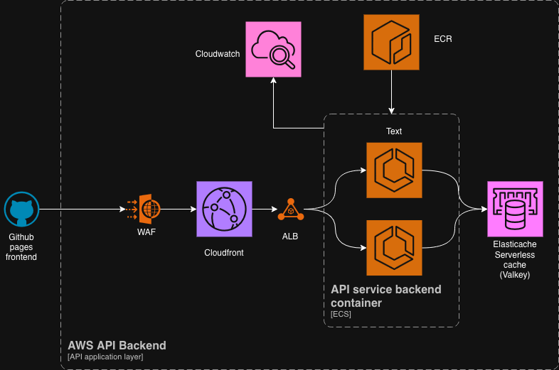

# URL Shortener
 
A full-stack URL shortener built with TypeScript, deployed on AWS ECS with infrastructure managed by Terragrunt.
 
---

## What it does
 
- Shorten any URL to a slug — auto-generated (SHA-256 hash) or custom
- Redirect short links publicly with no auth required
- Per-user API key authentication — register, login, manage keys
- Click analytics per link — total count, IP, user-agent, referrer
- IP-based rate limiting on auth and redirect endpoints
 

## Architecture


---
 
## Repository structure
 
```
.
├── backend/                # Backend — Bun + Hono API
├── frontend/               # Frontend — Vite + vanilla TypeScript
├── infra/                  # Infrastructure — Terragrunt stacks
└── .github/workflows/      # CI/CD — GitHub Actions
```
 
---


## Docs
 
| Component | README |
|---|---|
| Backend API | [backend/README.md](backend/README.md) |
| Frontend | [frontend/README.md](frontend/README.md) |
| Infrastructure | [infra/README.md](infra/README.md) |
 
---

## DEMO URL
| Component | URL |
|------------|---------|
| Frontend | https://leander343.github.io/babbel-devops-test/|
| Backend(SSL) |  https://d3et0ngjkxwl3j.cloudfront.net |

Note: Since I don't own a domain, the ALB is placed behind a Cloudfront distribution just to mandate SSL and get it working with Github pages. The Frontend here is a handy tool to out the tool. 

## Known improvements
 
These are areas identified during development that would be addressed in a more complete production setup.
 
**1. Secrets and parameters**
There is currently some manual clickops involved in wiring up environment variables and GitHub Actions secrets after provisioning. This can be automated away by writing Terragrunt outputs directly to SSM Parameter Store, then having the CI/CD pipeline pull them from SSM at runtime rather than requiring manual secret entry in the GitHub UI. A bootstrapping script would also make spinning up new environments much more self-contained
 
**2. WAF**
The current WAF setup uses AWS WAF v2 with managed rule sets, which covers the basics but is relatively coarse. Given the choice, Cloudflare is a stronger option as its bot management, DDoS mitigation, and traffic analysis tooling are significantly more capable, and its WAF rules are easier to reason about and tune. Migrating would involve pointing the ALB behind a Cloudflare proxy and removing the AWS WAF association. 
 
**3. Multi-environment extensibility**
The Terragrunt stack structure can be extended to supports multiple environments by moving current stack files into respective `infra/envs/<env>/terragrunt.stack.hcl`. Extending to  new environments aftewards (e.g. `staging`) is straightforward as adding a new stack file with its own locals. The main remaining work is adding conditionals to the CI/CD matrix and ensuring environment-specific variable sets are managed consistently, likely through the SSM approach mentioned above.
 
**4. Bootstrapping script**
There is no automated way to set up the prerequisites for a brand new AWS account or environment — OIDC provider, IAM role, S3 state bucket, DynamoDB lock table, and ECR repository all require either manual steps or a separate bootstrap run. A shell script or small Terraform root module that handles this setup would make onboarding a new environment significantly faster and remove the remaining manual steps before `terragrunt stack apply` can run. There's also a specific way to achieve this through the use of Cloudformation and stack sets to deploy defaults. 
 
**5. Monitoring coverage**
Monitoring is currently limited to application-level CloudWatch logs and basic ALB health checks. A more complete setup would include: CloudWatch alarms on ALB 5xx rate and ECS task restarts, ElastiCache (Valkey) metrics — memory usage, eviction rate, connection count wired into the same alarm set, and a structured logging format on the API side to make log queries actionable. In a production environment a dedicated observability tool (Datadog, Grafana) would be preferable to raw CloudWatch.
 
**6. Persistence layer**
ElastiCache Serverless (Valkey/Redis) is currently used as the primary persistence layer, which works well for a URL shortener given the read-heavy access pattern. In a more complete production setup it would be more appropriate to use Redis purely as a cache and rate-limit counter, with a relational database (RDS PostgreSQL) as the source of truth for links, users, and analytics. This would improve durability guarantees and make complex queries (e.g. analytics aggregation across users) significantly easier.
 